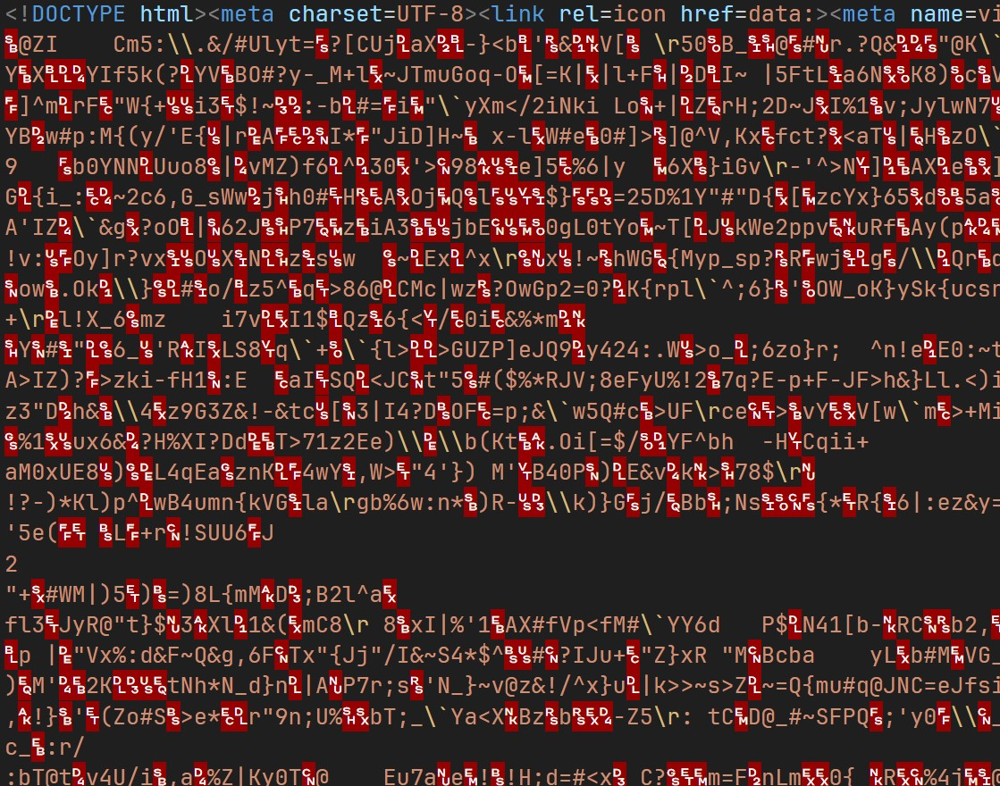

# vite plugin singlefile compression

Compress all assets and embeds them into `dist/index.html`, making it convenient to share as a single HTML file.

The recipient can open it directly in the browser without manually unzipping the file.

Using [DecompressionStream](https://developer.mozilla.org/docs/Web/API/DecompressionStream) + [base128-ascii](https://www.npmjs.com/package/base128-ascii).

## Setup

```
npm i vite-plugin-singlefile-compression
```

Then modify `vite.config.ts`, see [test/vite.config.ts](test/vite.config.ts)

```ts
// Import singleFileCompression
import singleFileCompression from 'vite-plugin-singlefile-compression'

export default defineConfig({
  plugins: [
    vue(),
    vueDevTools(),
    // Add singleFileCompression
    singleFileCompression(),
  ],
```

Then modify [src/router/index.ts](test/src/router/index.ts#L5)

```ts
const router = createRouter({
  // Use Hash History
  history: createWebHashHistory(),
```

## Options

Example:

```ts
singleFileCompression({
  rename: 'example.html'
}),
```

More info see [src/options.ts](src/options.ts)

```ts
export interface Options {
	/**
	 * Rename index.html
	 */
	rename?: string;

	/**
	 * https://github.com/terser/html-minifier-terser?tab=readme-ov-file#options-quick-reference
	 * @default defaultHtmlMinifierTerserOptions
	 */
	htmlMinifierTerser?: htmlMinifierOptions | boolean;

	/**
	 * Try inline html used assets, if inlined or not used in JS.
	 * @default true
	 */
	tryInlineHtmlAssets?: boolean;

	/**
	 * Remove inlined asset files.
	 * @default true
	 */
	removeInlinedAssetFiles?: boolean;

	/**
	 * Try inline html icon, if icon is in public dir.
	 * @default true
	 */
	tryInlineHtmlPublicIcon?: boolean;

	/**
	 * Remove inlined html icon files.
	 * @default true
	 */
	removeInlinedPublicIconFiles?: boolean;

	/**
	 * Use Base128 to encode gzipped script.
	 * If false, use Base64.
	 * https://www.npmjs.com/package/base128-ascii
	 * @default true
	 */
	useBase128?: boolean;

	/**
	 * Compress format.
	 * @default "deflate-raw"
	 */
	compressFormat?: compressFormat;
}
```

## Effect

https://bddjr.github.io/vite-plugin-singlefile-compression/

```
vite v6.2.6 building for production...
✓ 45 modules transformed.
rendering chunks (1)...

vite-plugin-singlefile-compression 2.0.5 building...

  file:///D:/code/js/vite-plugin-singlefile-compression/test/dist/index.html
  101.63 KiB -> 46.42 KiB

Finish.

dist/index.html  47.53 kB
✓ built in 770ms
```



## Clone

```
git clone https://github.com/bddjr/vite-plugin-singlefile-compression
cd vite-plugin-singlefile-compression
npm i
cd test
npm i
cd ..
npm run build
```
