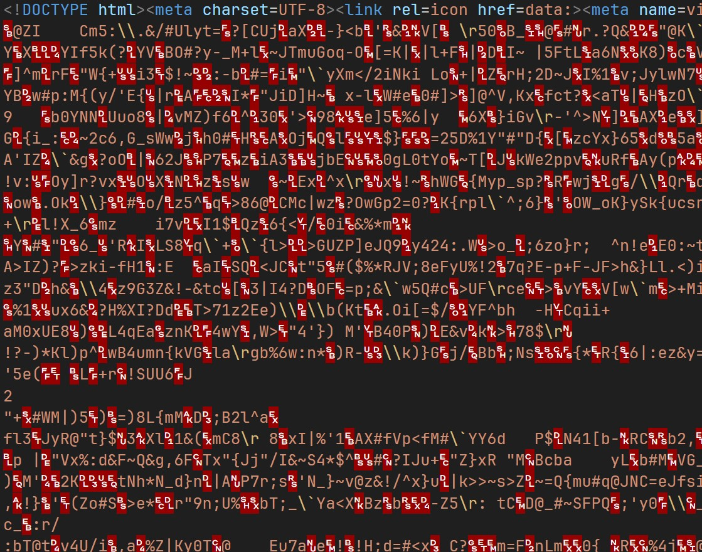

# vite plugin singlefile compression

Compress all assets and embeds them into `dist/index.html`, making it convenient to share as a single HTML file.

The recipient can open it directly in the browser without manually unzipping the file.

Using [DecompressionStream](https://developer.mozilla.org/docs/Web/API/DecompressionStream) + [base128-ascii](https://www.npmjs.com/package/base128-ascii).

## Setup

```
npm i vite-plugin-singlefile-compression@latest -D
```

Then modify `vite.config.ts`, like [test/vite.config.ts](test/vite.config.ts)

```diff
+ import singleFileCompression from 'vite-plugin-singlefile-compression'

  export default defineConfig({
    plugins: [
      vue(),
      vueDevTools(),
+     singleFileCompression(),
    ],
```

Then use hash history, like [test/src/router/index.ts](test/src/router/index.ts)

```diff
  const router = createRouter({
-   history: createWebHistory(),
+   history: createWebHashHistory(),
```

## Options

Example:

```ts
singleFileCompression({
  rename: 'example.html'
}),
```

More info see [src/options.ts](src/options.ts)

```ts
export interface Options {
    /**
     * Enable compress.
     * @default true
     */
    enableCompress?: boolean

    /**
     * Use Base128 to encode compressed script.
     * If false, use Base64.
     * https://www.npmjs.com/package/base128-ascii
     * @default true
     */
    useBase128?: boolean

    /**
     * Compress format.
     * 
     * https://developer.mozilla.org/en-US/docs/Web/API/DecompressionStream/DecompressionStream
     * 
     * @type {"deflate-raw" | "deflate" | "gzip" | "brotli" | "zstd" | "deflateRaw" | "gz" | "br" | "brotliCompress" | "zstandard" | "zst"}
     * 
     * @default "deflate-raw"
     */
    compressFormat?: CompressFormat | CompressFormatAlias

    /**
     * Custom compressor.
     */
    compressor?: Compressor

    /**
     * Rename index.html
     */
    rename?: string

    /**
     * https://github.com/terser/html-minifier-terser?tab=readme-ov-file#options-quick-reference
     * @default defaultHtmlMinifierTerserOptions
     */
    htmlMinifierTerser?: HtmlMinifierOptions | boolean

    /**
     * Try inline html used assets, if inlined or not used in JS.
     * @default true
     */
    tryInlineHtmlAssets?: boolean

    /**
     * Remove inlined asset files.
     * @default true
     */
    removeInlinedAssetFiles?: boolean

    /**
     * Try inline html icon, if icon is in public dir.
     * @default true
     */
    tryInlineHtmlPublicIcon?: boolean

    /**
     * Remove inlined html icon files.
     * @default true
     */
    removeInlinedPublicIconFiles?: boolean

    /**
     * Use import.meta polyfill.
     * @default true
     */
    useImportMetaPolyfill?: boolean
}
```

## Effect

Preview: https://bddjr.github.io/vite-plugin-singlefile-compression/

```
vite v8.0.0 building client environment for production...
✓ 42 modules transformed.
rendering chunks (1)...

vite-plugin-singlefile-compression 2.1.1 deflate-raw base128-ascii

  file:///D:/code/js/vite-plugin-singlefile-compression/test/dist/index.html
  124.013 kB -> 50.35 kB

Finish.

computing gzip size...
dist/index.html  50.35 kB │ gzip: 43.87 kB

✓ built in 296ms
```



## Clone

```
git clone https://github.com/bddjr/vite-plugin-singlefile-compression
cd vite-plugin-singlefile-compression
npm i
cd test
npm i
cd ..
node --run build
```
